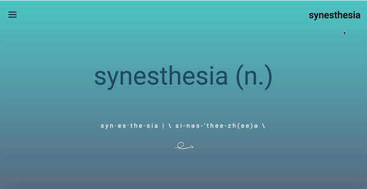

# Synesthesia
## Dartmouth College CS52 21S Final Project

## Project Description
Synesthesia is a web app that allows users to log in with their Spotify account and then take a personalized quiz, in which we associate characteristic features of different songs with colors. Using these associations, the user can create a playlist based on a color, using songs from their own Spotify library.

We visualize this as being not only a fun experience users can share with their friends, but also a way for users to gain insight into how they view music and to revisit forgotten songs from their library. 

### Sample Screenshots/GIFs

Welcome screen and authentication in action:

Color association quiz with color sliders that change the background:

Playlist generation color selection and new playlist:

## Architecture

### Directories:
* src
    * actions
        * User Actions:
        *   updateUser - gets new user and authorizes them
        *   setGuest - if not choosing to login, handles
        *   updateUserTracks - pulls in user's tracks to check for audio features
        *   updateUserLibrary - updates user library
        *   updateUserColorMap - updates the users audio feature-color associations
        * Redux Actions:
        *   storeColor - stores color in redux state with the user
        * Other:
        *   fetchPlaylist - uses user's new color map and makes a call to the Flask to generate a playlist
    * components
        * an app functional component with references to other functional components
        * The welcome screen as a functional component with information about the app
        * Sign in screen - continue as guest or login with Spotify
        * Quiz component - generates quiz questions to ask for a color for each feature
        * results - for showing color/feature map to the user
        * playlist color selector and playlist - for creating and displaying a playlist 
    * reducers
        * color - helps assign colors to audio features
        * oauth - allows connection to Spotify auth API
        * playlist - helps with calls to make playlists
        * song - gets and stores current songs
        * user - keeps track of current user and their actions
    * static
        * Animation of logo fo welcome screen

### Additional tools/libraries used:
* Webpack
* babel
* React-redux
* react-router
* react-router-dom
* rc-slider (color picker)

## Setup
How to get the project dev environment up and running, npm install etc

* Clone both the [frontend](https://github.com/dartmouth-cs52-21S/project-synesthesia) and [backend](https://github.com/dartmouth-cs52-21S/project-api-synesthesia) repositories
* run `npm install webpack` in the terminal
* for Mac OS, run `npm start` in both repositories
* for Windows OS, run `npm start-windows` in both repositories

Then,
* Clone the [Flask API](https://github.com/dartmouth-cs52-21S/project-other-synesthesia)
* follow instructions to run the server

## Deployment
Frontend is set up to be deployed on [Netlify](https://www.netlify.com/)

* Deployed frontend on Netlify: [frontend](https://project-synesthesia.netlify.app/)
* Deployed backend on Heroku: [backend](https://project-api-synesthesia.herokuapp.com/)
* Deployed Flask API on Heroku: [Flask API](https://project-other-synesthesia.herokuapp.com/)

* Once any changes are made, push to your current branch
* Make a PR, once merged into main the netlify will redeploy!

## Authors

* [Zachary Campbell](http://zachcampbell.me)
* [Bennett Clark](https://github.com/bennettc)
* [Blake Danziger](https://github.com/bdanziger3)
* [Laurel Dernbach](http://laureldernbach.me/)
* [Hamza Kasumba](https://github.com/HamzaMusana)
* [Isaac Spokes](https://github.com/isaacspokes)

## Acknowledgments

Starter pack for this code pulled from [Laurel's starter pack repo](https://github.com/dartmouth-cs52-21S/starterpack-laureldernbach), built up through various short assignments in class.

Special thanks go to Tim Tregubov, to Catherine Parnell, and to all the other TA's for their enormous help during the making of this project and throughout the term. 
